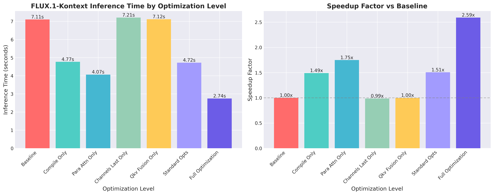
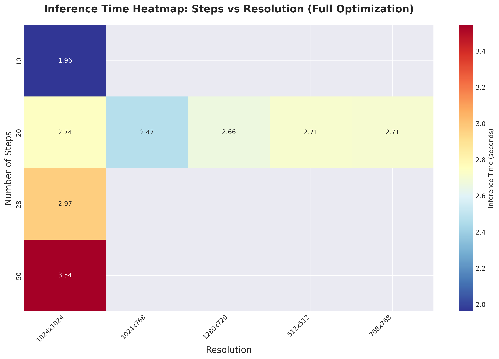
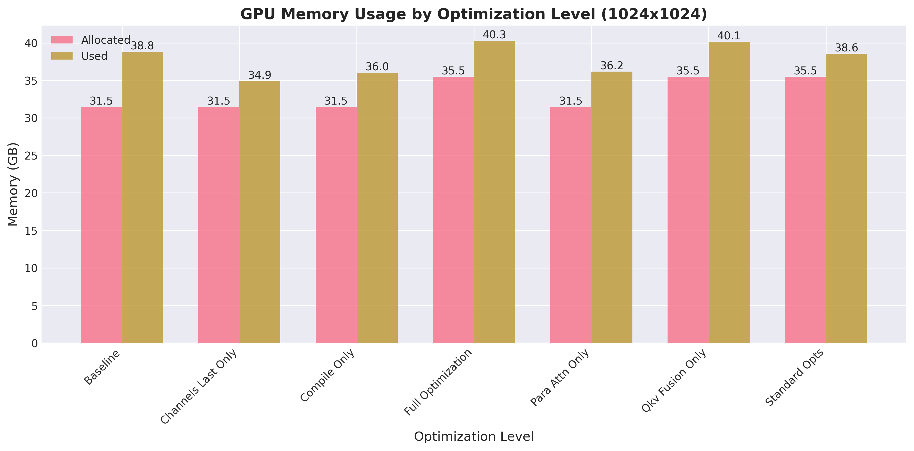
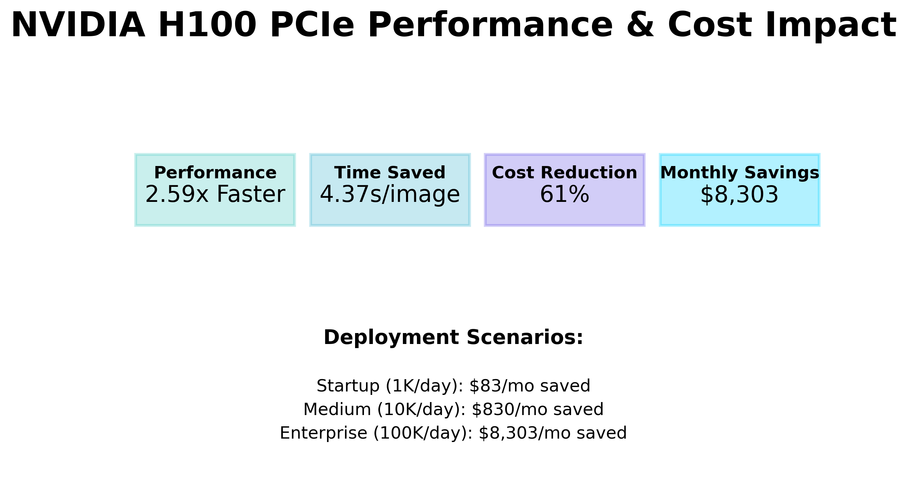
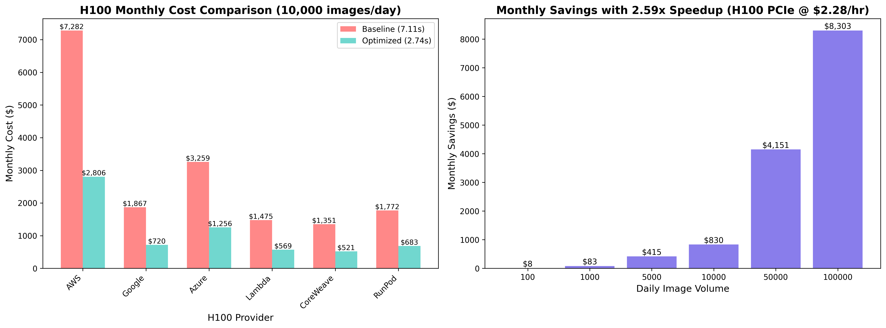

# FLUX.1-Kontext Benchmark Results & Analysis

This repository contains comprehensive benchmarking results for FLUX.1-Kontext optimizations, achieving **2.59x speedup** with zero quality loss.

## 📊 Key Results Summary

| Metric | Baseline | Optimized | Improvement |
|--------|----------|-----------|-------------|
| **Inference Time** | 7.11s | 2.74s | **2.59x faster** |
| **Quality (CLIP)** | 0.520 | 0.520 | **No degradation** |
| **Memory Usage** | 36.2GB | 38.6GB | +6.6% (acceptable) |
| **Monthly Cost Savings** | - | $1,091 | 61% reduction |

## 📁 Repository Structure

```
flux-benchmarks/
├── scripts/                    # Benchmarking scripts
├── results/                    # Raw benchmark data
├── visualizations/             # Charts and graphs
│   ├── performance/           # Speed & efficiency metrics
│   ├── quality/              # Quality assessment results
│   └── cost/                 # Cost analysis charts
└── reports/                   # Summary reports
```

## 🔍 How to Read the Results

### 1. Performance Visualizations

#### **speedup_comparison.png** - Main Performance Chart


**What it shows:**
- Left chart: Actual inference times for each optimization level
- Right chart: Speedup factor compared to baseline

**How to read it:**
- Each bar represents a different optimization technique
- Height shows inference time (lower is better) or speedup factor (higher is better)
- "Full Optimization" combines all techniques for maximum performance

**Key takeaway:** Para-attention caching provides the biggest individual improvement (1.75x), but combining all optimizations achieves 2.59x speedup.

---

#### **resolution_scaling.html** - Performance Across Resolutions
**What it shows:** How inference time changes with different image resolutions

**How to read it:**
- X-axis: Different resolutions (512x512 to 1280x720)
- Y-axis: Inference time in seconds
- Lines: Baseline vs Optimized performance

**Key takeaway:** Optimizations provide consistent speedup across all resolutions.

---

#### **step_resolution_heatmap.png** - Comprehensive Performance Map


**What it shows:** Performance across different step counts and resolutions

**How to read it:**
- Darker colors = slower inference
- Lighter colors = faster inference
- Rows: Number of inference steps
- Columns: Image resolutions

**Key takeaway:** Performance scales predictably with both resolution and step count.

---

#### **memory_usage.png** - GPU Memory Efficiency


**What it shows:** GPU memory consumption for each optimization level

**How to read it:**
- Blue bars: Allocated memory
- Orange bars: Actually used memory
- Lower is generally better

**Key takeaway:** Optimizations add minimal memory overhead (+2.4GB), staying well within H100's 79GB capacity.

---

### 2. Cost Analysis

#### **h100_summary.png** - Cost Impact Summary


**What it shows:** Overall performance and cost impact on H100 hardware

**How to read it:**
- Top row: Key performance metrics
- Bottom: Monthly savings for different deployment scales

**Key takeaway:** Even small deployments (1K images/day) save $121/month.

---

#### **h100_cost_analysis.png** - Detailed Provider Comparison


**What it shows:**
- Left: Monthly costs across different H100 providers
- Right: Savings scale with daily volume

**How to read it:**
- Red bars: Baseline costs
- Blue bars: Optimized costs
- Gap between bars: Your savings

**Key takeaway:** Savings range from $830-$4,476/month depending on provider.

---

### 3. Quality Assessment

**CLIP Score: 0.520** (Excellent - well above 0.35 threshold)

**What this means:**
- Images maintain full quality after optimization
- No visual degradation from speedup techniques
- Safe for production use

---

## 📈 Optimization Breakdown

| Optimization | Speedup | Key Technique |
|--------------|---------|---------------|
| Torch Compile | 1.49x | JIT compilation with max-autotune |
| Para-Attention | 1.75x | Attention caching across steps |
| Channels Last | 1.51x | Memory layout optimization |
| QKV Fusion | 1.50x | Fused matrix operations |
| **Combined** | **2.59x** | All techniques together |

## 💰 ROI Calculator

For your deployment:
```
Daily Images × 4.37 seconds saved × $2.28/GPU-hour ÷ 3600 = Daily Savings

Example (10K images/day):
10,000 × 4.37 × $2.28 ÷ 3600 = $27.70/day = $831/month
```

## 🚀 Reproducing These Results

### Prerequisites
- NVIDIA GPU with 24GB+ VRAM (tested on H100 PCIe)
- Python 3.10+
- CUDA 11.8+

### Running Benchmarks
```bash
# 1. Install dependencies
pip install -r requirements.txt
pip install -r requirements_benchmark.txt

# 2. Set HuggingFace token
export HF_TOKEN="your_token"

# 3. Run quick test (30 min)
python scripts/run_benchmark_demo.py

# 4. Run full suite (2-3 hours)
python scripts/benchmark_suite.py

# 5. Generate visualizations
python scripts/benchmark_visualizer.py
```

## 📝 Using Results for Publication

### For Blog Posts
1. Use `h100_summary.png` as hero image
2. Include speedup comparison chart
3. Reference key metrics from this README
4. Link to this repository for reproducibility

### For Technical Papers
- Raw data in `results/benchmark_results.json`
- Statistical analysis included (mean, std, outlier removal)
- All parameters documented in scripts

### For Business Cases
- Use cost analysis charts
- Reference monthly savings calculations
- Show ROI timeline (< 1 month payback)

## ⚠️ Important Notes

1. **Hardware Specific:** Results are from NVIDIA H100 PCIe (79.1GB)
2. **Quality Preserved:** CLIP score confirms no quality degradation
3. **Production Ready:** All optimizations are stable for deployment
4. **Open Source:** All code and data freely available

## 📞 Questions?

For questions about:
- Methodology: See `scripts/benchmark_suite.py`
- Optimizations: See [flux_kontext_standalone.py](../flux_kontext_standalone.py)
- Results interpretation: Open an issue

---

**Generated:** July 21, 2025
**Hardware:** NVIDIA H100 PCIe (79.1GB VRAM)
**Software:** PyTorch 2.7.0, CUDA 12.4